# VPC Architecture Flow Diagram

## Infrastructure Overview
This diagram shows the complete AWS VPC setup created by your Terraform configuration.

```mermaid
graph TB
    %% Internet and External Access
    Internet[🌐 Internet] 
    
    %% AWS Region
    subgraph Region["🌍 AWS Region: us-east-1"]
        
        %% VPC Container
        subgraph VPC["🏢 VPC: HR-stag-myvpc<br/>CIDR: 10.0.0.0/16"]
            
            %% Internet Gateway
            IGW[🚪 Internet Gateway<br/>HR-stag]
            
            %% Availability Zone A
            subgraph AZ_A["📍 Availability Zone: us-east-1a"]
                
                subgraph PubSubA["🌐 Public Subnet A<br/>10.0.101.0/24"]
                    NAT_A[🔄 NAT Gateway<br/>+ Elastic IP]
                end
                
                subgraph PrivSubA["🔒 Private Subnet A<br/>10.0.201.0/24"]
                    PrivRes_A[💻 Private Resources<br/>EC2, etc.]
                end
                
                subgraph DBSubA["🗄️ Database Subnet A<br/>10.0.21.0/24"]
                    DB_A[🗃️ Database Resources<br/>RDS, etc.]
                end
            end
            
            %% Availability Zone B
            subgraph AZ_B["📍 Availability Zone: us-east-1b"]
                
                subgraph PubSubB["🌐 Public Subnet B<br/>10.0.102.0/24"]
                    PubRes_B[🌍 Public Resources<br/>Load Balancers, etc.]
                end
                
                subgraph PrivSubB["🔒 Private Subnet B<br/>10.0.202.0/24"]
                    PrivRes_B[💻 Private Resources<br/>EC2, etc.]
                end
                
                subgraph DBSubB["🗄️ Database Subnet B<br/>10.0.22.0/24"]
                    DB_B[🗃️ Database Resources<br/>RDS, etc.]
                end
            end
            
            %% Route Tables
            subgraph RouteTables["📋 Route Tables"]
                PubRT[📤 Public Route Table<br/>Routes to IGW]
                PrivRT[📥 Private Route Table<br/>Routes to NAT Gateway]
                DBRT[🗄️ Database Route Table<br/>Isolated routing]
            end
            
            %% Database Subnet Group
            DBSubnetGroup[🗂️ DB Subnet Group<br/>hr-stag-myvpc<br/>Spans both AZs]
            
            %% Security Groups
            DefaultSG[🛡️ Default Security Group<br/>VPC-wide rules]
            
            %% Network ACLs
            DefaultNACL[🔐 Default Network ACL<br/>Subnet-level security]
        end
    end
    
    %% External Connections
    Internet --> IGW
    IGW --> PubSubA
    IGW --> PubSubB
    
    %% Internal VPC Connections
    PubSubA --> NAT_A
    NAT_A --> PrivSubA
    NAT_A --> PrivSubB
    
    %% Route Table Associations
    PubRT -.-> PubSubA
    PubRT -.-> PubSubB
    PrivRT -.-> PrivSubA
    PrivRT -.-> PrivSubB
    DBRT -.-> DBSubA
    DBRT -.-> DBSubB
    
    %% Database Subnet Group Association
    DBSubnetGroup -.-> DBSubA
    DBSubnetGroup -.-> DBSubB
    
    %% Security Group Associations
    DefaultSG -.-> PrivRes_A
    DefaultSG -.-> PrivRes_B
    DefaultSG -.-> DB_A
    DefaultSG -.-> DB_B
    
    %% Network ACL Associations
    DefaultNACL -.-> PubSubA
    DefaultNACL -.-> PubSubB
    DefaultNACL -.-> PrivSubA
    DefaultNACL -.-> PrivSubB
    DefaultNACL -.-> DBSubA
    DefaultNACL -.-> DBSubB
    
    %% Styling
    classDef vpc fill:#e1f5fe,stroke:#01579b,stroke-width:3px
    classDef public fill:#c8e6c9,stroke:#2e7d32,stroke-width:2px
    classDef private fill:#ffecb3,stroke:#f57f17,stroke-width:2px
    classDef database fill:#f8bbd9,stroke:#c2185b,stroke-width:2px
    classDef gateway fill:#e8f5e8,stroke:#4caf50,stroke-width:2px
    classDef security fill:#fff3e0,stroke:#ff6f00,stroke-width:2px
    
    class VPC vpc
    class PubSubA,PubSubB,PubRes_B public
    class PrivSubA,PrivSubB,PrivRes_A,PrivRes_B private
    class DBSubA,DBSubB,DB_A,DB_B,DBSubnetGroup database
    class IGW,NAT_A gateway
    class DefaultSG,DefaultNACL security
```

## Configuration Details

### **Terraform Variables Used:**
- **Business Division:** HR
- **Environment:** stag
- **AWS Region:** us-east-1
- **VPC Name:** HR-stag-myvpc

### **Network Architecture:**

#### **🏢 VPC Configuration**
- **CIDR Block:** 10.0.0.0/16
- **DNS Hostnames:** Enabled
- **DNS Support:** Enabled
- **Name:** HR-stag-myvpc

#### **🌐 Public Subnets**
- **Subnet A:** 10.0.101.0/24 (us-east-1a)
- **Subnet B:** 10.0.102.0/24 (us-east-1b)
- **Features:** Auto-assign public IPs, Internet Gateway access

#### **🔒 Private Subnets**
- **Subnet A:** 10.0.201.0/24 (us-east-1a)
- **Subnet B:** 10.0.202.0/24 (us-east-1b)
- **Features:** NAT Gateway access for outbound internet

#### **🗄️ Database Subnets**
- **Subnet A:** 10.0.21.0/24 (us-east-1a)
- **Subnet B:** 10.0.22.0/24 (us-east-1b)
- **Features:** Isolated, DB Subnet Group for RDS

#### **🚪 Gateways**
- **Internet Gateway:** For public subnet internet access
- **NAT Gateway:** Single NAT in first public subnet for private subnet outbound

#### **📋 Routing**
- **Public Route Table:** Routes 0.0.0.0/0 → Internet Gateway
- **Private Route Table:** Routes 0.0.0.0/0 → NAT Gateway
- **Database Route Table:** Isolated routing for database tier

#### **🛡️ Security**
- **Default Security Group:** Applied to all resources
- **Default Network ACL:** Subnet-level security rules
- **Tags Applied:** Owner=HR, Environment=stag, Name=HR-stag

## Traffic Flow

### **📥 Inbound Traffic:**
1. Internet → Internet Gateway → Public Subnets
2. Public Subnets → Private Subnets (internal routing)
3. Private Subnets → Database Subnets (application tier access)

### **📤 Outbound Traffic:**
1. Private Subnets → NAT Gateway → Internet Gateway → Internet
2. Database Subnets → (Isolated, no direct internet access)
3. Public Subnets → Internet Gateway → Internet

### **🔄 High Availability:**
- Resources deployed across 2 Availability Zones
- Single NAT Gateway (cost-optimized)
- Database Subnet Group spans both AZs for RDS Multi-AZ
